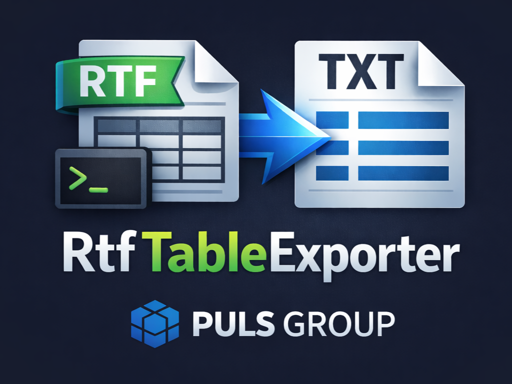

# RtfTableExporter



Кроссплатформенная консольная утилита на .NET для быстрого экспорта данных из `RTF` в `TXT`.

Из каждого входного файла берется только самая большая верхнеуровневая таблица. Из нее отрезаются заголовки и служебные строки шапки, после чего в файл попадают только строки с данными.

## Что умеет

- Если входные пути не переданы, программа обрабатывает все `*.rtf`, которые лежат рядом с исполняемым файлом.
- Можно передать один файл, несколько файлов, папку или wildcard-маску.
- Если выходной путь не задан, `txt` сохраняются рядом с исполняемым файлом.
- Если выходной путь задан как папка, все результаты складываются туда.
- Если обрабатывается ровно один файл, можно задать точный путь к итоговому `txt`.
- Готовые `txt` перезаписываются. Если конкретный файл перезаписать нельзя, ошибка уходит в `stderr`, а остальные файлы продолжают обрабатываться.
- Разделитель по умолчанию: `|`.
- Разделитель можно заменить на любой свой, включая TAB.
- Есть безопасная проверка обновлений из GitHub Releases. Ошибки обновления не валят основную обработку.

## Базовые примеры

```bash
RtfTableExporter
RtfTableExporter file1.rtf file2.rtf
RtfTableExporter --input file1.rtf --input file2.rtf
RtfTableExporter --input C:\data\
RtfTableExporter --input C:\data\*.rtf
RtfTableExporter --input file.rtf --output C:\result\
RtfTableExporter --input file.rtf --output C:\result\file.txt
RtfTableExporter --input file.rtf --delimiter ";"
RtfTableExporter --input file.rtf --delimiter "\t"
RtfTableExporter --input file.rtf --tab
```

## Логика вывода

`stdout`:

- `SAVED|<input>|<output>`
- `SUMMARY|<successCount>|<failureCount>`

`stderr`:

- `ERROR|<input>|<message>`
- `ERROR|<input>|<output>|<message>`
- `UPDATE|<message>`

## Коды возврата

- `0` все файлы обработаны успешно
- `1` ошибка аргументов
- `2` входные `rtf` не найдены
- `3` все обработки завершились ошибкой
- `4` фатальная ошибка приложения
- `5` частичный успех: часть файлов обработана, часть нет

## Вызов из другой программы

Рекомендуемый сценарий:

1. Запустить `exe` с набором входных файлов или без аргументов.
2. Читать `stdout` построчно и забирать строки `SAVED|...`.
3. Читать `stderr` как журнал ошибок.
4. Проверять `ExitCode`.

Для пакетного режима это удобнее, чем один-единственный путь в выводе, потому что на одном запуске может быть обработано сразу несколько файлов.

## Автообновление

Автообновление работает так:

- приложение смотрит последний GitHub Release
- ищет архив под текущую платформу
- скачивает его
- планирует замену файлов после завершения текущего процесса

Ошибки обновления только логируются. Основная обработка `RTF` не прерывается.

Чтобы автообновление работало в локальной сборке, можно передать:

```bash
RtfTableExporter --github-repo owner/repo
```

или задать переменную среды:

```bash
RTF_TABLE_EXPORTER_GITHUB_REPOSITORY=owner/repo
```

В релизных бинарниках, собранных через GitHub Actions, репозиторий встраивается автоматически.

## Локальная публикация

PowerShell:

```powershell
.\publish-all.ps1 -Version 1.2.3 -GitHubRepository owner/repo
```

Bash:

```bash
./publish-all.sh Release 1.2.3 owner/repo
```

Скрипты публикуют self-contained single-file сборки для:

- `win-x64`
- `linux-x64`
- `linux-musl-x64`
- `linux-arm64`

## Публикация в GitHub и автосборка релиза

В проект уже добавлен workflow:

- [release.yml](.github/workflows/release.yml)

Он срабатывает при push тега вида `v*`, например `v1.0.0`.

### Как опубликовать репозиторий

Если репозиторий еще не создан:

```bash
git init
git branch -M main
git add .
git commit -m "Первичная версия приложения RtfTableExporter"
git remote add origin https://github.com/<owner>/RtfTableExporter.git
git push -u origin main
```

### Как выпустить релиз

После того как код уже в GitHub:

```bash
git tag v1.0.0
git push origin v1.0.0
```

После этого GitHub Actions автоматически:

- соберет self-contained single-file бинарники
- упакует сборки в `.zip`
- создаст GitHub Release
- приложит архивы для всех поддерживаемых платформ
- приложит файл `SHA256SUMS.txt`

### Что нужно проверить в GitHub

- репозиторий должен быть доступен для GitHub Actions
- workflow permissions должны позволять `contents: write`
- теги нужно пушить в тот же репозиторий, где лежит проект

### Как обновить релиз

Для новой версии:

```bash
git add .
git commit -m "Описание изменений"
git push origin main
git tag v1.0.1
git push origin v1.0.1
```

Workflow сам соберет и опубликует новый релиз.

## Документация

- Подробное использование: [docs/USAGE.md](docs/USAGE.md)
- Что попадает в релиз и как им пользоваться: [docs/RELEASE_OVERVIEW.md](docs/RELEASE_OVERVIEW.md)
